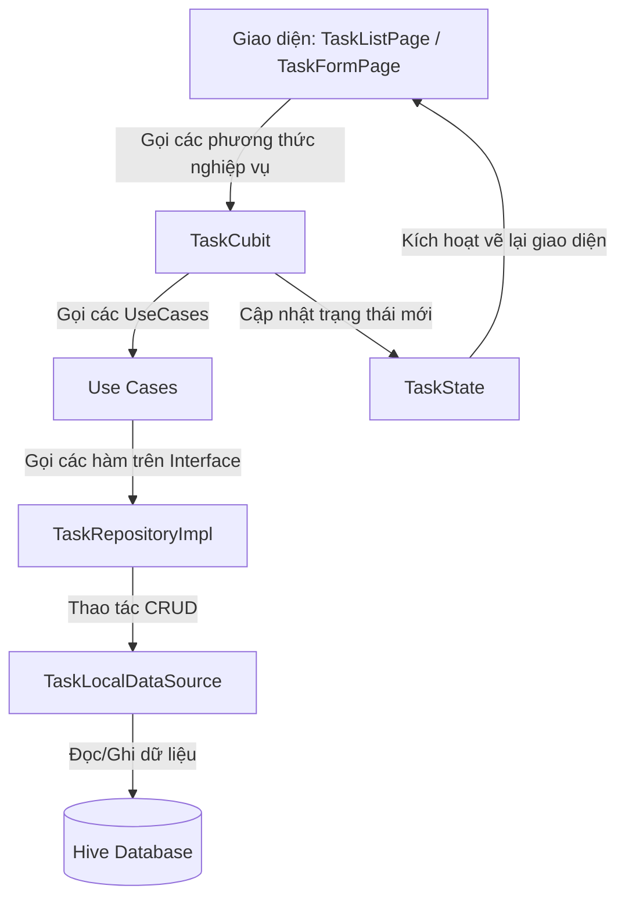

# Task Space - Flutter Task Manager (Cubit & Hive)

Ứng dụng quản lý công việc (Task Manager) được thiết kế theo kiến trúc phân lớp Clean Architecture và quản lý trạng thái bằng Cubit pattern kết hợp với cơ sở dữ liệu cục bộ Hive.

## Demo
<p align="center">
  <video src="https://github.com/user-attachments/assets/09372848-f3f3-4df7-8387-847040b220c8" width="400" controls></video>
</p>
---

## 1. Kiến trúc ứng dụng (Architecture)

Ứng dụng chia làm 3 phân lớp chính (Data, Domain, Presentation) độc lập và tuân thủ nguyên tắc Dependency Inversion:

```
lib/
├── domain/                      # Lớp Nghiệp vụ (Business Logic)
│   ├── entities/                # Thực thể nghiệp vụ thuần Dart (TaskEntity)
│   ├── repositories/            # Hợp đồng / Interfaces quy định nghiệp vụ (TaskRepository)
│   └── usecases/                # Các ca sử dụng (GetTasksUseCase, AddTaskUseCase, ...)
├── data/                        # Lớp Dữ liệu (Data Source & Models)
│   ├── datasources/             # Tương tác trực tiếp DB (TaskLocalDataSource)
│   ├── models/                  # Định dạng lưu trữ, mapping dữ liệu với Hive (TaskModel)
│   └── repositories/            # Thực thi interface của Domain (TaskRepositoryImpl)
├── presentation/                # Lớp Giao diện & Trạng thái
│   ├── bloc/                    # Quản lý State bằng Cubit (TaskCubit, TaskState)
│   └── pages/                   # Giao diện chính (TaskListPage, TaskFormPage)
└── main.dart                    # Điểm chạy app, khởi tạo DI và Hive
```

---

## 2. Luồng xử lý Trạng thái (State Flow Diagram)

Dưới đây là sơ đồ luồng dữ liệu và trạng thái trong ứng dụng:



### Luồng Lọc và Tìm kiếm Realtime:
1. Khi người dùng nhập từ khóa tìm kiếm hoặc chọn bộ lọc (Status/Priority).
2. UI kích hoạt `setSearchQuery`, `setStatusFilter` hoặc `setPriorityFilter` trên `TaskCubit`.
3. `TaskCubit` phát hành (emit) trạng thái mới cập nhật giá trị bộ lọc.
4. Thuộc tính getter `filteredTasks` định nghĩa sẵn trong `TaskState` sẽ tự động tính toán lại danh sách hiển thị khớp với bộ lọc và cập nhật ngay lập tức lên UI mà không cần truy vấn lại cơ sở dữ liệu.

---

## 3. Lựa chọn công nghệ & Đánh đổi (Trade-offs)

### Quản lý trạng thái bằng Cubit vs BLoC
- **Lý do chọn Cubit:** Cubit tối giản hóa boilerplate code so với BLoC truyền thống. Nó sử dụng trực tiếp các phương thức thay vì định nghĩa thêm hệ thống Events & Mapping, giúp code gọn gàng, dễ bảo trì đối với một ứng dụng quy mô vừa và nhỏ.
- **Đánh đổi:** Đối với ứng dụng lớn có nhiều sự kiện phức tạp cần tối ưu hóa (ví dụ: throttling, debouncing, transform events), BLoC sẽ linh hoạt hơn. Tuy nhiên với tính năng tìm kiếm, chúng ta đã tối ưu hóa trực tiếp ở tầng giao diện/cubit nên Cubit hoàn toàn đáp ứng tốt.

### Sử dụng Hive làm Cơ sở dữ liệu cục bộ
- **Lý do chọn Hive:** Hive là cơ sở dữ liệu key-value được viết hoàn toàn bằng Dart, tốc độ đọc/ghi cực nhanh (vượt trội hơn SQLite/SharedPreferences), hỗ trợ mạnh mẽ cơ chế sinh code Adapter (`build_runner`) giúp chống sai sót kiểu dữ liệu.
- **Đánh đổi:** Hive không hỗ trợ các câu lệnh truy vấn phức tạp (JOINs) hay quan hệ dữ liệu sâu giống như SQLite. Do đó, logic tìm kiếm và lọc phải được xử lý trực tiếp trên RAM sau khi tải toàn bộ danh sách, điều này có thể ảnh hưởng nhỏ đến hiệu năng nếu danh sách công việc lên đến hàng trăm nghìn phần tử. Đối với Task Manager thông thường, số lượng công việc ít nên Hive là sự lựa chọn tối ưu nhất về mặt tốc độ và sự đơn giản.

### Phân tách TaskEntity & TaskModel
- **Lý do chọn:** `TaskEntity` thuộc tầng Domain hoàn toàn độc lập với thư viện bên ngoài. `TaskModel` thuộc tầng Data đóng vai trò ánh xạ dữ liệu và đính kèm annotation của Hive.
- **Đánh đổi:** Chúng ta phải viết thêm code để ánh xạ (mapping) giữa Model và Entity thông qua các hàm `toEntity()` và `fromEntity()`. Tuy nhiên, điều này đảm bảo tính đúng đắn của Clean Architecture, giúp dễ dàng thay thế Hive bằng một DB khác (ví dụ: Isar, SQLite) mà không cần chỉnh sửa bất kỳ dòng code nào ở tầng Domain hay Presentation.
